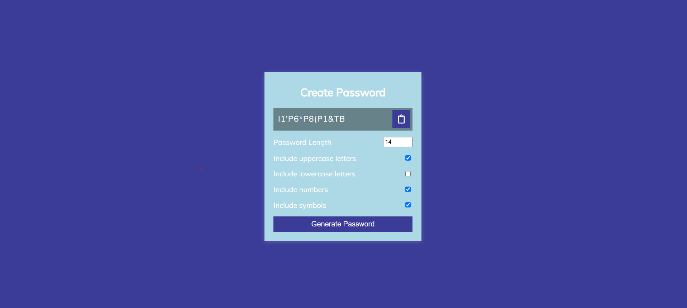

## What to build

we have to build Password Generator App.

## Input

## Techanology used

we have used HTML, CSS and JavaScript DOM

## What I have learned from this project

I have learned how to generate random lower case later, upper case latter, number and symbol using javascript and created password using those random later, also learned how to copy that password on clickboard.

## Output

### Instructor

**Hitesh choudhary**
